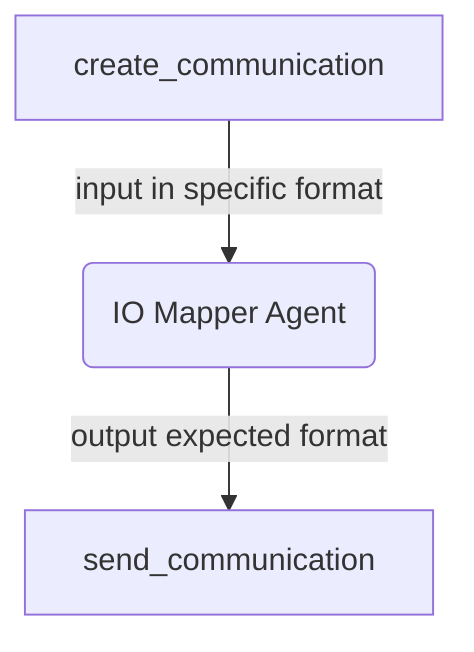

# Usage

There are several different ways to leverage the IO Mapper functions in Python. There
is an [agentic interface](#use-agent-io-mapper) using models that can be invoked on
different AI platforms and a [imperative interface](#use-imperative--deterministic-io-mapper)
that does deterministic JSON remapping without using any AI models.

## Key features

The Agent IO Mapper uses an LLM/model to transform the inputs (typically output of the
first agent) to match the desired output (typically the input of a second agent). As such,
it additionally supports specifying the model prompts for the translation. The configuration
object provides a specification for the system and default user prompts:

## Example Agent IO mapping

#### LangGraph Example 1
This project supports specifying model interations using [LangGraph](https://langchain-ai.github.io/langgraph/).

### Define an agent io mapper metadata
```python
metadata = IOMappingAgentMetadata(
    input_fields=["selected_users", "campaign_details.name"],
    output_fields=["stats.status"],
)

```
The abobe instruction directs the IO mapper agent to utilize the ```selected_users``` and ```name``` from the ```campaign_details``` field and map them to the ```stats.status```. Here is an example to illustrate this further. No further information is needed since the type information can be derived from the input data which is a pydantic model.

Bellow is a table that explain each fields of the IOMappingAgentMetadata class and how to use each

<table>
    <tr>
        <th>Field</th>
        <th>Description</th>
        <th>Required</th>
        <th>Example</th>
    </tr>
    <tr>
        <td>input_fields</td>
        <td>an array of json paths </td>
        <td>:white_check_mark:</td>
<td>

```["state.fiedl1", "state.field2", "state"]```            
</td>
    </tr>
    <tr>
        <td>output_fields</td>
        <td>an array of json paths </td>
        <td>:white_check_mark:</td>
<td>

```["state.output_fiedl1"]```
</td>
    </tr>
    <tr>
        <td>input_schema</td>
        <td>defines the schema of the input data</td>
        <td> :heavy_minus_sign: </td>
        <td>
            
```json
{ 
    "type": "object",
    "properties": {
        "title": {"type": "string"},
        "ingredients": {"type": "array", "items": {"type": "string"}},
        "instructions": {"type": "string"},
    },
    "required": ["title", "ingredients, instructions"],
}
```
<hr />
OR

```python
from pydantic import TypeAdapter
TypeAdapter(GraphState).json_schema()
```
</td>
    </tr>
    <tr>
        <td>output_schema</td>
        <td>defines the schema for the output data</td>
        <td>:heavy_minus_sign:</td>
        <td>same as input_schema</td>
    </tr>
    <tr>
        <td>output_description_prompt</td>
        <td>A prompt structured using a Jinja template that can be used by the llm in the mapping definition</td>
        <td>:heavy_minus_sign:</td>
        <td>
    
```python
"""Output as JSON with this structure:
{{
"name": "Campaign Name",
"content": "Campaign Content",
"is_urgent": "yes/no"
}}
"""
```
</td>
</tr>
</table>

### Define an Instance of the Agent 
```python
mapping_agent = IOMappingAgent(metadata=metadata, llm=llm)
 ```
Bellow is the tablex explaining the interface of the IOMappingAgent class
<table>
    <tr>
        <th>Field</th>
        <th>Description</th>
        <th>Required</th>
        <th>Example</th>
    </tr>
    <tr>
        <td>metadata</td>
        <td></td>
        <td>:white_check_mark:</td>
<td>
            
```python
IOMappingAgentMetadata(
    input_fields=["documents.0.page_content"],
    output_fields=["recipe"],
    input_schema=TypeAdapter(GraphState).json_schema(),
    output_schema={
        "type": "object",
        "properties": {
            "title": {"type": "string"},
            "ingredients": {"type": "array", "items": {"type": "string"}},
            "instructions": {"type": "string"},
        },
        "required": ["title", "ingredients, instructions"],
    },
)
```
 </td>
</tr>

<tr>
    <td>llm</td>
    <td>An instance of the large language model to be used</td>
    <td>:white_check_mark:</td>
<td>
    
```python
        AzureChatOpenAI(
            model=model_version,
            api_version=api_version,
            seed=42,
            temperature=0,
        )
```
</td>
</tr>
</table>


### Add the node to the LangGraph graph 
```python
workflow.add_node(
    "io_mapping",
    mapping_agent.langgraph_node,
)
```

### Finally add the edge and you can run the your LangGraph graph
```python
workflow.add_edge("create_communication", "io_mapping")
workflow.add_edge("io_mapping", "send_communication")
```
Here is a flow chart of io mapper in a langgraph graph of the discussed application


#### LangGraph Example 2
This example involves a multi-agent software system designed to process a list of ingredients. It interacts with an agent specialized in recipe books to identify feasible recipes based on the provided ingredients. The information is then relayed to an IO mapper, which converts it into a format suitable for display to the user.

### Define an agent io mapper metadata

```python
metadata = IOMappingAgentMetadata(
    input_fields=["documents.0.page_content"],
    output_fields=["recipe"],
    input_schema=TypeAdapter(GraphState).json_schema(),
    output_schema={
        "type": "object",
        "properties": {
            "title": {"type": "string"},
            "ingredients": {"type": "array", "items": {"type": "string"}},
            "instructions": {"type": "string"},
        },
        "required": ["title", "ingredients, instructions"],
    },
)
```

### Define an Instance of the Agent 
```python
mapping_agent = IOMappingAgent(metadata=metadata, llm=llm)
```

### Add the node to the LangGraph graph
```python
graph.add_node(
    "recipe_io_mapper",
    mapping_agent.langgraph_node,
)
```

### Finally add the edge and you can run the your LangGraph graph
```
graph.add_edge("recipe_expert", "recipe_io_mapper")
```

#### LlamaIndex
This project supports specifying model interations using [LangGraph](https://langchain-ai.github.io/langgraph/).


### LlamaIndex AgentWorkflow

## Use Imperative / Deterministic IO Mapper

The code snippet below illustrates a fully functional deterministic mapping that
transforms the output of one agent into input for a second agent. The code for the
agents is omitted.

```python
 # define schema for the origin agent
 input_schema = {"question": {"type": "string"}}

 # define schema to witch the input should be converted to
 output_schema = {
     "quiz": {
         "type": "object",
         "properties": {
             "prof_question": {"type": "string"},
             "due_date": {"type": "string"},
         },
     }
 }

 # the mapping object using jsonpath, note: the value of the mapping
 # can be either a jsonpath or a function
 mapping_object = {
     "prof_question": "$.question",
     "due_date": lambda _: datetime.now().strftime("%x"),
 }

 input = IOMapperInput(
     input=ArgumentsDescription(
         json_schema=Schema.model_validate(input_schema)
     ),
     output=ArgumentsDescription(
         json_schema=Schema.model_validate(output_schema)
     ),
     data={"question": output_prof},
 )
 # instantiate the mapper
 imperative_mapp = ImperativeIOMapper(
     field_mapping=mapping_object,
 )
 # get the mapping result and send to the other agent
 mapping_result = imperative_mapp.invoke(input=input)
```

### Use Examples

1. To run the examples we strongly recommend that a
   [virtual environment is created](https://packaging.python.org/en/latest/guides/installing-using-pip-and-virtual-environments/)
2. Install the requirements file
3. From within examples folder run:

```shell
make run_imperative_example
```
