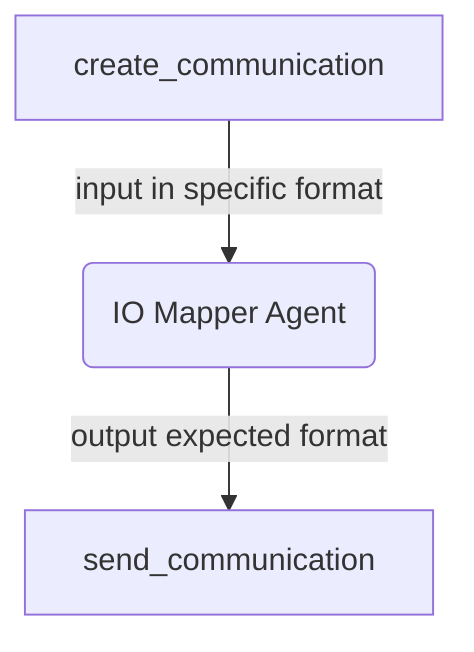

# Usage

There are several different ways to leverage the IO Mapper functions in Python. There
is an [agentic interface](#use-agent-io-mapper) using models that can be invoked on
different AI platforms and a [imperative interface](#use-imperative--deterministic-io-mapper)
that does deterministic JSON remapping without using any AI models.

## Key features

The Agent IO Mapper uses an LLM/model to transform the inputs (typically output of the
first agent) to match the desired output (typically the input of a second agent). As such,
it additionally supports specifying the model prompts for the translation. The configuration
object provides a specification for the system and default user prompts:

### Models

The Agntcy IO Mapper functions provided an easy to use package for mapping output from
one agent to another. The data can be described in JSON or with natural language. The
(incomplete) [pydantic](https://docs.pydantic.dev/latest/) models follow:

```python
class ArgumentsDescription(BaseModel):
    json_schema: Schema | None = Field(description="Data format JSON schema")
    description: str | None = Field(description="Data (semantic) natural language description")

class BaseIOMapperInput(BaseModel):
    input: ArgumentsDescription = Field(description="Input data descriptions")
    output: ArgumentsDescription = Field(description="Output data descriptions")
    data: Any = Field(description="Data to translate")

class BaseIOMapperOutput(BaseModel):
    data: Any = Field(description="Data after translation")
    error: str | None = Field(description="Description of error on failure.")

class BaseIOMapperConfig(BaseModel):
    validate_json_input: bool = Field(description="Validate input against JSON schema.")
    validate_json_output: bool = Field(description="Validate output against JSON schema.")
```

```python
class AgentIOMapperConfig(BaseIOMapperConfig):
    system_prompt_template: str = Field(
        description="System prompt Jinja2 template used with LLM service for translation."
    )
    message_template: str = Field(
        description="Default user message template. This can be overridden by the message request."
    )
```

and the input object supports overriding the user prompt for the requested translation:

```python
class AgentIOMapperInput(BaseIOMapperInput):
    message_template: str | None = Field(
        description="Message (user) to send to LLM to effect translation.",
    )
```

## Supported Packages
Further specification of models and their arguments is left to the underlying supported
packages:

- [Pydantic-AI](#pydantic-ai)
- [LangGraph](#langgraph)

#### Pydantic-AI
One of the supported platforms for managing the model interactions is [Pydantic-AI](https://ai.pydantic.dev/).

#### LangGraph
This project supports specifying model interations using [LangGraph](https://langchain-ai.github.io/langgraph/).

#### LlamaIndex
This project supports specifying model interations using [LangGraph](https://langchain-ai.github.io/langgraph/).

# Interface

<table>
    <tr>
        <th>Field</th>
        <th>Description</th>
        <th>Required</th>
        <th>Example</th>
    </tr>
    <tr>
        <td>input_fields</td>
        <td>an array of json paths </td>
        <td>:white_check_mark:</td>
<td>

```["state.fiedl1", "state.field2", "state"]```            
</td>
    </tr>
    <tr>
        <td>output_fields</td>
        <td>an array of json paths </td>
        <td>:white_check_mark:</td>
<td>

```["state.output_fiedl1"]```
</td>
    </tr>
    <tr>
        <td>input_schema</td>
        <td>defines the schema of the input data</td>
        <td> :heavy_minus_sign: </td>
        <td>
            
```json
{ 
    "type": "object",
    "properties": {
        "title": {"type": "string"},
        "ingredients": {"type": "array", "items": {"type": "string"}},
        "instructions": {"type": "string"},
    },
    "required": ["title", "ingredients, instructions"],
}
```
<hr />
OR

```python
from pydantic import TypeAdapter
TypeAdapter(GraphState).json_schema()
```
</td>
    </tr>
    <tr>
        <td>output_schema</td>
        <td>defines the schema for the output data</td>
        <td>:heavy_minus_sign:</td>
        <td>same as input_schema</td>
    </tr>
    <tr>
        <td>output_template</td>
        <td>A prompt structured using a Jinja template.</td>
        <td>:heavy_minus_sign:</td>
        <td>
    
```python
"""Output as JSON with this structure:
{{
"name": "Campaign Name",
"content": "Campaign Content",
"is_urgent": "yes/no"
}}
"""
```
</td>
</tr>
</table>
## You can use IO Mapper agent with LangGraph or LlamaIndex

## LangGraph 
In LangGraph, use states typed as Python TypedDict or, preferably, with Pydantic. Here are two examples of adding an IO mapper to a LangGraph graph. Note that we assume you already have a LangGraph graph created, so those steps are omitted.
### Pydantic state
```python
from agntcy_iomapper.langgraph import (
    io_mapper_node,
)
```
You can effortlessly designate the input fields requiring mapping, as well as the desired output fields.

The following instruction directs the IO mapper agent to utilize the ```selected_users``` and ```name``` from the ```campaign_details``` field and map them to the ```stats.status```. Here is an example to illustrate this further.
```python
workflow.add_node(
    "io_mapping",
    io_mapper_node,
    metadata={
        "input_fields": ["selected_users", "campaign_details.name"],
        "output_fields": ["stats.status"],
    },
)
```
:warning: It is crucial to ensure that the configurations required by the IO mapper node are included in the ```metadata``` dictionary when adding the LangGraph node. Failure to do so may result in improper functionality or errors.


```python
workflow.add_edge("create_communication", "io_mapping")
workflow.add_edge("io_mapping", "send_communication")
```
Here is a flow chart of io mapper in a langgraph graph of the discussed application

:warning: Very important to set the llm instance to be used by the iomapper agent, in the runnable config with the key llm before you invoke the graph
```python
config = RunnableConfig(configurable={"llm": llm})
app.invoke(inputs, config)
```
## TypedDict state
This example involves a multi-agent software system designed to process a list of ingredients. It interacts with an agent specialized in recipe books to identify feasible recipes based on the provided ingredients. The information is then relayed to an IO mapper, which converts it into a format suitable for display to the user.

Consider the following state

```python
class GraphState(TypedDict):
    query: RecipeQuery
    documents: Union[List[Document], None]
    recipe: Union[RecipeResponse, None]
    formatted_output: Union[str, None]
```

This line shows how io-mapper could be added to such application
```python
graph.add_node(
    "recipe_io_mapper",
    io_mapper_node,
    metadata={
        "input_fields": ["documents.0.page_content"],
        "input_schema": TypeAdapter(GraphState).json_schema(),
        "output_schema": {
            "type": "object",
            "properties": {
                "title": {"type": "string"},
                "ingredients": {"type": "array", "items": {"type": "string"}},
                "instructions": {"type": "string"},
            },
            "required": ["title", "ingredients, instructions"],
        },
        "output_fields": ["recipe"],
    },
)
```
Finally one can add the edge.

```python
graph.add_edge("recipe_expert", "recipe_io_mapper")
```

Compile and run the graph
```
llm = get_azure()
config = RunnableConfig(configurable={"llm": llm})
app = graph.compile()

# Example usage
query = {
    "query": {"ingredients": ["pasta", "tomato"]},
    "documents": None,
    "response": None,
    "formatted_output": None,
}
result = app.invoke(query, config)
```

## Use with LlamaIndex
### LlamaIndex Workflow

### LlamaIndex AgentWorkflow

## Use Imperative / Deterministic IO Mapper

The code snippet below illustrates a fully functional deterministic mapping that
transforms the output of one agent into input for a second agent. The code for the
agents is omitted.

```python
 # define schema for the origin agent
 input_schema = {"question": {"type": "string"}}

 # define schema to witch the input should be converted to
 output_schema = {
     "quiz": {
         "type": "object",
         "properties": {
             "prof_question": {"type": "string"},
             "due_date": {"type": "string"},
         },
     }
 }

 # the mapping object using jsonpath, note: the value of the mapping
 # can be either a jsonpath or a function
 mapping_object = {
     "prof_question": "$.question",
     "due_date": lambda _: datetime.now().strftime("%x"),
 }

 input = IOMapperInput(
     input=ArgumentsDescription(
         json_schema=Schema.model_validate(input_schema)
     ),
     output=ArgumentsDescription(
         json_schema=Schema.model_validate(output_schema)
     ),
     data={"question": output_prof},
 )
 # instantiate the mapper
 imperative_mapp = ImperativeIOMapper(
     field_mapping=mapping_object,
 )
 # get the mapping result and send to the other agent
 mapping_result = imperative_mapp.invoke(input=input)
```

### Use Examples

1. To run the examples we strongly recommend that a
   [virtual environment is created](https://packaging.python.org/en/latest/guides/installing-using-pip-and-virtual-environments/)
2. Install the requirements file
3. From within examples folder run:

```shell
make run_imperative_example
```
